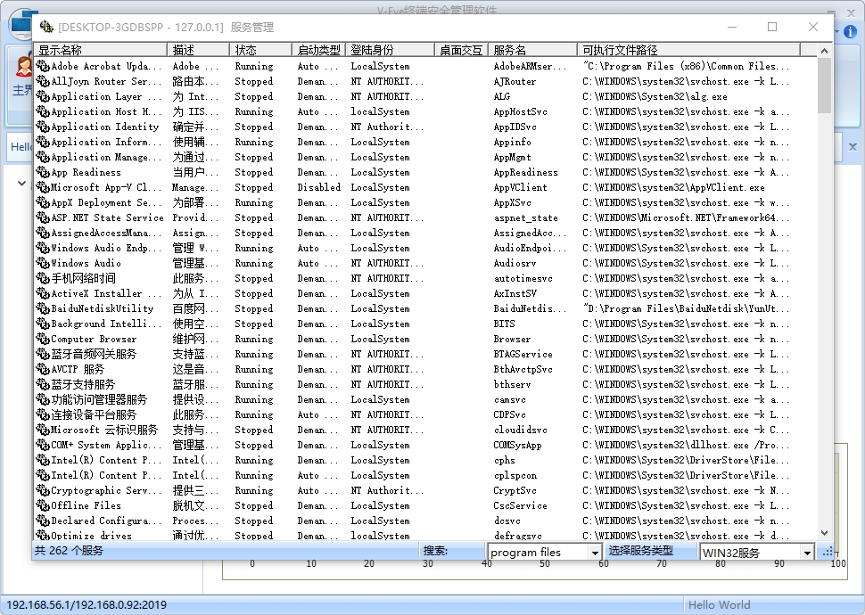

# WorldGh0st 远控程序

此**ReadMe**文档来自：
[TechBlog: 【亲自指挥】手把手教你编译GHOST远控程序](https://github.com/yuanyuanxiang/TechBlog/blob/master/%E8%BF%9C%E6%8E%A7%E7%A8%8B%E5%BA%8F/02.%E3%80%90%E4%BA%B2%E8%87%AA%E6%8C%87%E6%8C%A5%E3%80%91%E6%89%8B%E6%8A%8A%E6%89%8B%E6%95%99%E4%BD%A0%E7%BC%96%E8%AF%91GHOST%E8%BF%9C%E6%8E%A7%E7%A8%8B%E5%BA%8F.md) 

我没有在网上找到有关该远控程序的详细资料，从代码来看，这是基于Gh0st的一款程序，界面形如World，我猜测它因故得此名。

此项目的原始代码来自 [Logkiss](https://github.com/Logkiss/Rat-winos4.0-gh0st)。我在此表示感谢！

原始项目包含一系列远控相关程序，本人没有 **Fork**，而是将能够编译的项目clone到本人GitHub，单独管理维护。望请见谅！

## 1.资料准备

**源代码**：https://github.com/Logkiss/Rat-winos4.0-gh0st

**编译工具**：Visual Studio 2019

将 *Rat-winos4.0-gh0st* 项目拷贝至本地，例如" *D:\Rat-winos4.0-gh0st* "。

**Xtreme Toolkit Pro（v18.5）**：一款为开发者提供丰富的用户界面（UI）组件库和工具集的软件开发工具包，
特别适用于C++和MFC（Microsoft Foundation Classes）开发。
它提供了一整套UI控件和工具，旨在简化Windows桌面应用程序的开发过程。我使用的版本
在[这里](https://blog.csdn.net/SilenceNet/article/details/126132736)可以下载。


## 2.打开项目


我们用VS2019打开“**Client.sln**”解决方案，可见目前此项目是用VS2015编译器，平台工具集显示为“Visual Studio 2013”。
我们手动将平台工具集升级为VS2019，Windows SDK升级到最新版本（10.0），看看能否编译。

## 3.编译项目

## 3.1 Xtreme Toolkit Pro依赖问题

您需要下载前文所述“**Xtreme Toolkit Pro（v18.5）**”并在本地进行编译。将相关目录添加到项目属性中：

C++头文件附加包含目录： *D:\github\XTToolkitPro\Source*

C++库文件附加包含目录： *D:\github\XTToolkitPro\lib\vc160*

资源文件附加包含目录： *D:\github\XTToolkitPro\Source*

经过我的试验，上述“资源文件”的附加包含目录没有添加也是可以的。

## 3.2 编译 *Client*


在解决完 3.1 问题以后，编译Client非常顺利，这样就生成了Client程序。虽然它名为Client，实际上是通讯的客户端程序，
也就是主控程序。

## 3.3 对于参数“_Ty”，“string”不是有效的 模板 类型变量


这个错误很容易解决，如果您安装了VC编程助手，那么它会提示您添加头文件，即可解决。


在解决完 3.3 问题以后，编译Server也是非常顺利，这样就生成了Server程序。Server程序实际上是受控端程序。

## 4. 程序概览

| 序号  | 文件/文件夹 | 描述  |
|------|----|------|
| 1  | Client | 主控程序代码目录|  
| 2  | Public | 公共代码目录 |
| 3  | Server | 受控程序代码目录 |
| 4  | third-party | 主控程序的依赖项(复制到主控程序 _Styles_ 目录)|
| 5  | **Client.sln** | VS解决方案文件|
 
我个人判断此项目的代码质量较佳，不论是代码风格，还是逻辑实现方法。具备文件管理、远程协助、
系统管理、服务管理、键盘记录等功能。





## 5. 调试方法

在Debug模式下，调试启动Client程序，实际是WorldGh0st的服务端控制程序；再调试启动Server程序，实际是受控端程序。
注意，在启动Server程序时会自动注册开机启动项，详见：*Rat-winos4.0-gh0st\worldgh0st\Server\Server.cpp*

## 6. 免责声明

程序被报告病毒属于正常现象，请您自行编译程序。项目代码仅限于学习和交流用途。任何人使用该软件所造成的后果， 由其本人承担。

## 7. 代码风格

```bat
for /R %F in (*.cpp *.h) do astyle --style=linux "%F"
```

## 8. 变更记录

- [2025/01/31]

此为首次提交：升级编译工具为Visual Studio 2019，删除无关文件。

- [2025/02/01]

针对键盘记录功能进行小幅修改，并修复第一个问题： [#1 Don't use global variable extern CString strHost](https://github.com/yuanyuanxiang/Gh0st/issues/1)
